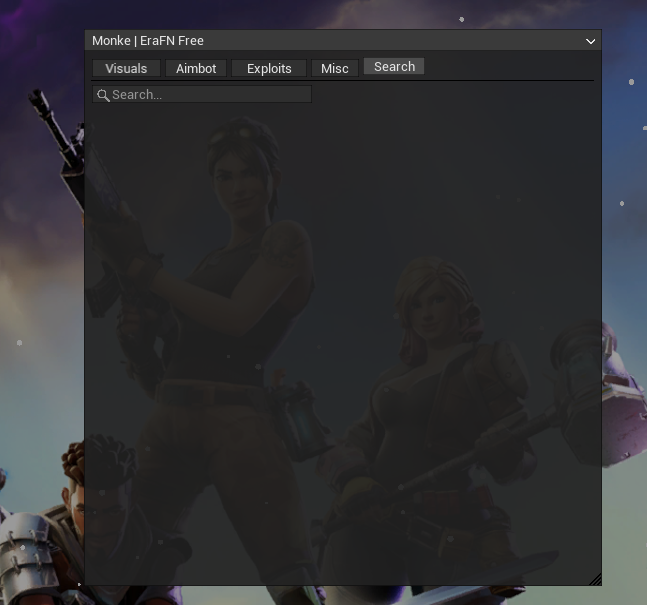
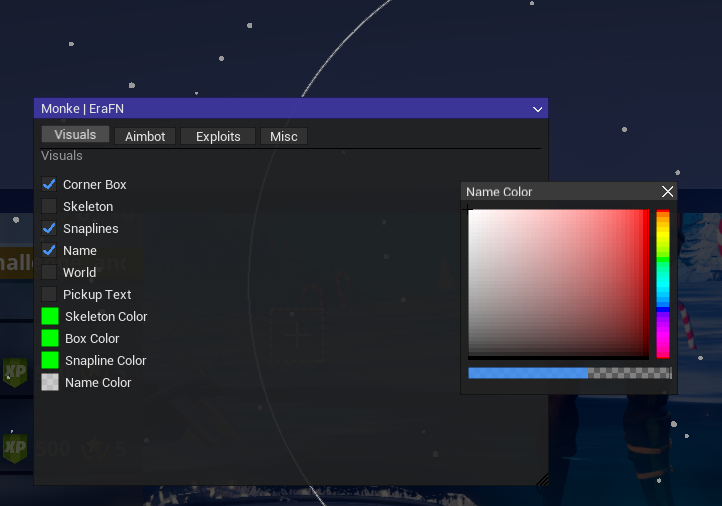
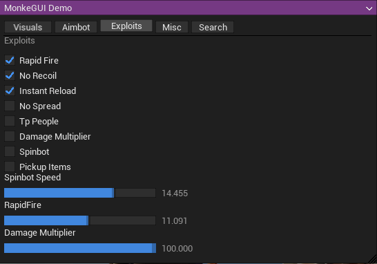
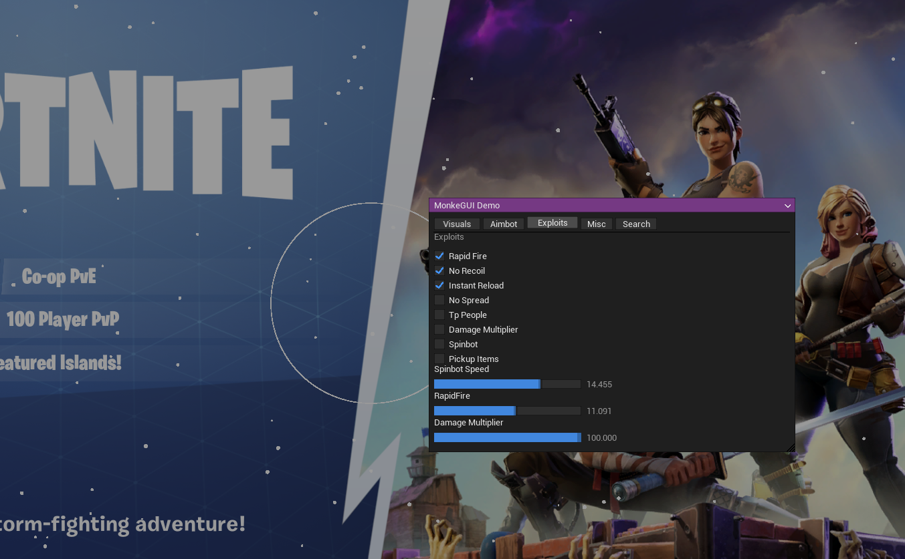

# MonkeGUI

Lightweight animated immediate-mode GUI framework for Unreal Engine canvas rendering. Inspired by [Dear ImGui](https://github.com/ocornut/imgui), built entirely on `UCanvas` with no external GUI dependencies.

---

## Preview

| Menu | Widgets |
|------|---------|
|  |  |

| Color Picker | Tabs / Combo |
|-------------|--------------|
|  |  |

For full API reference, see [DOCUMENTATION.md](DOCUMENTATION.md)

### Video Showcase

<p align="center">
  <a href="https://youtu.be/XlFDaLO_2MQ">
    
  </a>
</p>

---

## Features

- Immediate-mode API — no retained widget tree
- Fully rendered via `UCanvas` — no external render dependencies
- Smooth animations on every widget (hover, press, open/close)
- Window dragging and resizing
- Collapsible windows
- Tabs, combo boxes, sliders, checkboxes, color picker, popups, search bar
- Custom styling via `MonkeGUI::Style` namespace
- UE4 / UE5 compatible

---

## Requirements

- Unreal Engine 4 or 5
- A valid `UCanvas*` (e.g. from `PostRender`)
- A 1×1 white `UTexture*` (used for all filled rect rendering)
- A `UFont*`
- C++
- Windows (mouse input via `GetAsyncKeyState` / `GetCursorPos`)

> **SDK note:** MonkeGUI references `FLinearColor`, `FVector2D`, `UCanvas`, `UTexture`, and `UFont` from your UE SDK headers. Make sure these are available in your include path before including `MonkeGUI.h`.

---

## Quick Start

### 1. Initialize each frame

Call these at the top of your render function, before any widgets:

```cpp
MonkeGUI::SetWhiteTexture(myWhiteTexture); // 1x1 white UTexture*
MonkeGUI::SetFont(myFont);                 // UFont*
MonkeGUI::SetupCanvas(Canvas, DeltaTime);  // resets state, updates mouse
```

### 2. Draw your UI

```cpp
static FVector2D pos  = { 200.f, 150.f };
static FVector2D size = { 400.f, 300.f };

if (MonkeGUI::Begin("My Window", &pos, &size, true))
{
    static bool enabled = false;
    MonkeGUI::Checkbox("Enable Feature", &enabled);

    if (MonkeGUI::Button("Execute"))
    {
        // handle click
    }

    MonkeGUI::End();
}
```

### 3. Flush the draw queue

```cpp
MonkeGUI::Render(); // always call last
```

---

## Widgets

| Widget | Function |
|--------|----------|
| Text | `MonkeGUI::Text(label)` |
| Button | `MonkeGUI::Button(label, width)` |
| Checkbox | `MonkeGUI::Checkbox(label, &bool)` |
| Slider | `MonkeGUI::SliderFloat(label, &float, min, max)` |
| Combo | `MonkeGUI::Combo(label, &index, items, count)` |
| Color Picker | `MonkeGUI::ColorPicker(label, &FLinearColor)` |
| Separator | `MonkeGUI::Separator()` |
| Search Bar | `MonkeGUI::SearchBar(label, buf, size)` |
| Tabs | `BeginTabs()` / `TabItem()` / `EndTabs()` |
| Popup | `OpenPopup(id)` / `BeginPopup(id, size)` / `EndPopup()` |

---

## Tabs Example

```cpp
static int tab = 0;

MonkeGUI::BeginTabs();
MonkeGUI::TabItem("General",  0, &tab);
MonkeGUI::TabItem("Advanced", 1, &tab);
MonkeGUI::EndTabs();

if (tab == 0) { /* general widgets */ }
if (tab == 1) { /* advanced widgets */ }
```

## Search Bar Example

```cpp
static char search[128]{};
MonkeGUI::SearchBar("##search", search, sizeof(search));

for (int i = 0; i < count; i++)
    if (MonkeGUI::SearchMatches(names[i], search))
        MonkeGUI::Checkbox(names[i], &enabled[i]);
```

## Popup Example

```cpp
if (MonkeGUI::Button("Open Info"))
    MonkeGUI::OpenPopup("info");

if (MonkeGUI::BeginPopup("info", { 220.f, 100.f }))
{
    MonkeGUI::Text("Hello from a popup!");
    if (MonkeGUI::Button("Close", 80.f))
        MonkeGUI::OpenPopupId = -1;
    MonkeGUI::EndPopup();
}
```

---

## Styling

All style values are in `MonkeGUI::Style` and can be changed at any time:

```cpp
MonkeGUI::Style::Accent    = MonkeGUI::SRGB(255, 100, 50, 220); // orange accent
MonkeGUI::Style::WindowBg  = MonkeGUI::SRGB(20, 20, 20, 240);
MonkeGUI::Style::RowH      = 20.f;
```

The window background and title bar colors can also be changed at runtime:

```cpp
MonkeGUI::MenuBg  = someColor;
MonkeGUI::TitleBg = someColor;
```

---

## Optional: FPS Watermark

```cpp
// Set once at init
MonkeGUI::SetFPSCallback([]() -> float {
    return 1.0f / myDeltaTime;
});

// Call each frame (before Render)
MonkeGUI::Watermark("My App v1.0");
// renders: "My App v1.0 | 144 FPS"
```

---

## Optional: Snow Effect

```cpp
MonkeGUI::FX::SnowRender(DeltaTime, 0.85f); // call before Render()
```

---

## Known Limitations

- **Windows only** — mouse input uses `GetAsyncKeyState` and `GetCursorPos`.
- **Single context** — all state is global; multiple simultaneous GUI contexts are not supported.
- **Draw queue cap** — the post-render queue holds up to 2048 commands. Very complex layouts may silently drop commands.
- **No scrolling** — windows and combo boxes do not scroll; content that overflows is clipped.

---

## Design Goals

MonkeGUI was built to provide clean visuals and smooth animations with the simplest possible integration story — drop in one header, supply a canvas and a white texture, and start drawing.

---

## Credits

Inspired by [Dear ImGui](https://github.com/ocornut/imgui) by Omar Cornut.

---

## License

MIT — see [LICENSE](LICENSE).
